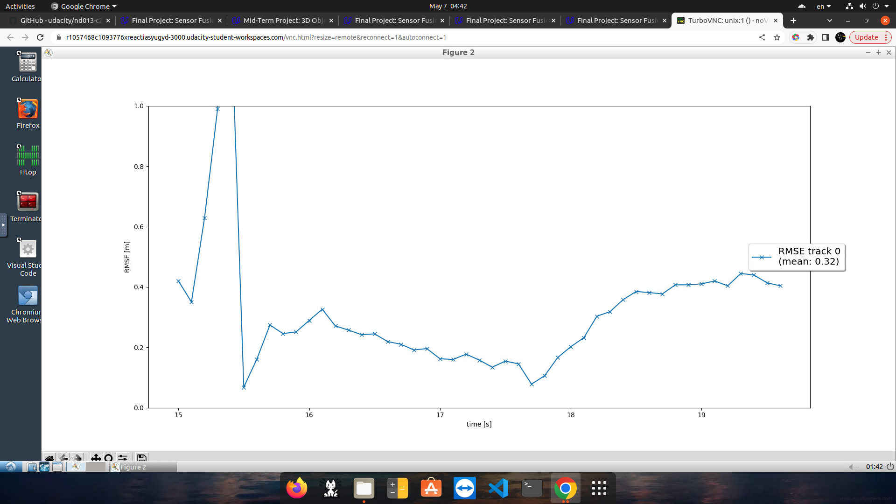

# Final Project: Sensor Fusion and Object Tracking

 This is the project for the second course in the Udacity Self-Driving Car Engineer Nanodegree Program : Sensor Fusion and Tracking.
___
# Introduction
In order to be able to start the project and keep up with me it is highly recommended check first the [UDACITY_README.md](UDACITY_README.md) which will brief you regarding the project and what models needs to be downloaded and fill you in with through the project.
## The final project consists of four main steps:
* Step 1: Implementing an extended Kalman filter.
* Step 2: Implementing track management including track state and track score, track initialization and deletion.
* Step 3: Implementing single nearest neighbour data association and gating.
* Step 4: Appling sensor fusion by implementing the nonlinear camera measurement model and a sensor visibility check.

The process will walk you through the implementation of sensor fusion system that is able to track vehicles over time with real-world camera and lidar measurements!
___
# Repository Overview
The final project uses the following folder structure and files:
* The main file for our lidar detection and tracking loop, which processes each measurement frame, is already known as `loop_over_dataset.py`
* `student/filter.py` contains the EKF class including predict and update step. EKF will be implemented in Step 1 of the project.
* `student/trackmanagement.py` includes two classes for tracking:
    * A class `Track` with attributes `x` and `P` for state and covariance. Both have fixed initial values implemented, but will be changed in Step 2.
    * A class `Trackmanagement` with a `track_list` to store all tracks, as well as methods to manage tracks. This will also be implemented in Step 2.
* `student/association.py` includes a class `Association` with logic to associate tracks to measurements and call the EKF update function with these associated measurements in `associate_and_update()`. Data association will be implemented in Step 3.
* `student/measurements.py` includes two classes for measurement handling:
    * A class `Sensor` which distinguishes between names `camera` and `lidar`. It includes the sensor's calibration data, field of view and coordinate transforms as well as the EKF measurement model.
    * A class `Measurement` with the attributes `z` and `R` for the measurement vector and corresponding covariance. The lidar measurement code is given and the camera measurement WILL be implemented (not given) for sensor fusion in Step 4.

* All parameters for tracking are included in `misc/params.py` . The parameters, such as the timestep, initialization parameters, track management settings, and gating threshold, should be loaded where needed. The parameters do not have to be modified. However, they can be tuned further after the project is completed to improve tracking, for example, by using the lidar standard deviation evaluated in the mid-term project. Changing parameters is recommended only after completion of Step 4 to avoid additional error sources.

___

## Project Instructions Step 1
### What is this task about?
In Step 1 of the final project, an EKF will be implemented to track a single real-world target with lidar measurement input over time!
### Task preparation
First of all, the same model settings for the Resnet neural network as in the mid-term project need to be applied. Therefore, the code solution from the mid-term project workspace in `student/objdet_detect.py` should be copied into the final project workspace.

To select the right single-target-scenario, apply the following settings in `loop_over_dataset.py`:
* Select Sequence 2 (`training_segment-10072231702153043603_5725_000_5745_000_with_camera_labels.tfrecord`) by uncommenting this line in loop_over_dataset.py and commenting the other sequences.
* Set `show_only_frames = [150, 200]` in order to limit the sequence to frames 150 to 200. This is the time span where our single object is visible.
* Set `configs_det = det.load_configs(model_name='fpn_resnet')` to use the Resnet neural network architecture. Note that Darknet is not applicable here because it does not estimate the height.
* Set `configs_det.lim_y = [-5, 10]` to limit the y-range and remove other targets left and right of our target. To do so, uncomment the respective line.
* Set `exec_detection = []` to skip the lidar detection for faster execution and to load the lidar results from file instead.
* Set `exec_tracking = ['perform_tracking']` to activate tracking.
* Set `exec_visualization = ['show_tracks']` for track visualization.
### Where to find this task?
This task involves writing code within the file `student/filter.py`
___

## Results

Single target tracking results 

___
Step 1 RMSE 

___

## Project Instructions Step 2
### What is this task about?

In Step 2 of the final project, track management will be implemented to initialize and delete tracks, set a track state, and a track score.

### Task preparation

In addition to the settings from Step 1, apply the following settings in `loop_over_dataset.py` :

* Set `show_only_frames = [65, 100]` in order to limit the sequence to frames 65 to 100. This is the time span where a single object appears and then disappears, so we can use it for track initialization and deletion.
* Set `configs_det.lim_y = [-5, 15]` to limit the y-range and remove other targets left and right of our target.

### Where to find this task?

This task involves writing code within the file `student/trackmanagement.py` . 
___

## Results

Step 2 in motion

Single line RMSE plot

___

## Project Instructions Step 3
### What is this task about?

In Step 3 of the final project, a single nearest neighbor data association will be implemented to associate measurements to tracks. The project will finally move on to multi-target tracking.

### Task preparation

In addition to the settings from Step 2, apply the following settings in `loop_over_dataset.py` :

* Select Sequence 1 (`training_segment-1005081002024129653_5313_150_5333_150_with_camera_labels.tfrecord`) by uncommenting this `line in loop_over_dataset.py` and commenting out the other sequences. This is a more complex scenario with multiple targets.
* Set `show_only_frames = [0, 200]` in order to use the whole sequence now.
* Set `configs_det.lim_y = [-25, 25]` to use the whole y-range including several targets.

### Where to find this task?

This task involves writing code within the file `student/association.py` .
_____
## Results

Step 3 in motion 

Tracking result with three tracks from Sequence 1.

_____

## Project Instructions Step 4
### What is this task about?
In Step 4 of the final project, the nonlinear camera measurement model will be implemented. The sensor fusion module for camera-lidar fusion will finally be completed.

### Task preparation
The settings are the same as for Step 3.

### Where to find this task?
This task involves writing code within the file `student/measurements.py` .

______

## Results
Step 4 in motion 

RMSE for the three valid tracks in Sequence 1
.png)

_______

# Writeup: Track 3D-Objects Over Time

## 1. Write a short recap of the four tracking steps and what you implemented there (filter, track management, association, camera fusion). Which results did you achieve? Which part of the project was most difficult for you to complete, and why?

### Step 1 EKF
In the `filter.py` file, EKF is used. Initially, the system's states [x, y, z, vx, vy, vz], process model, and constant velocity model are formulated. Subsequently, the 3D process models with constant velocity and noise covariances are used to determine the system matrix. This matrix is essential in calculating the state h(x) and Jacobian H. The current state calculation is performed by evaluating the functions h(x) and Jacobian H. The Kalman gain is then computed and employed to update the state and covariance.

.png)
If everything has been implemented correctly, the RMSE plot should show a mean RMSE of 0.35 or smaller.

### Step 2 Track Management
A new track is initialized using unassigned measurements. The unassigned measurement is first transformed from sensor coordinates to vehicle coordinates. The track score is then evaluated, and a decision is made to keep or delete the track based on a predetermined threshold. The updated track is then processed to determine its state, which is either confirmed or tentative, based on a separate confirmed threshold.

The following image shows the rmse plot for single tracking .

### Step 3 Data Association
This step involves performing the closest neighbor association, which correctly matches multiple measurements to multiple tracks. The association.py module introduces data association and employs the following steps:

Building a matrix containing all tracks and unassociated measurements.
Calculating the Mahalanobis distance for each track measurement.
Utilizing the Chi-Square hypothesis test to eliminate improbable track pairs.
Selecting the pair with the smallest Mahalanobis Distance, updating the Kalman Filter, and deleting the corresponding row and column from the relationship matrix.
A measurement is considered to be within a track's gate if the Mahalanobis distance is lower than the threshold computed from the inverse cumulative chi-squared distribution.

The following graph is plotted.

### Step 4 Camera & Sensor fusion
In this phase, we will augment the Kalman filter by incorporating the assumption that the center of the 3D bounding box for a vehicle corresponds to the center of its 2D representation in the imagery. This assumption is reasonably accurate, but it may not hold true for front-facing cameras in all cases. The implementation involves a projection matrix that maps points from 3D space to 2D geometry in the image. We measure the partial derivatives (x,y,z) to estimate the parameters (u,v) of the model, and also measure the noise (R). If the tracking status falls within the Field of View (FOV), we accept the measurement-track pair; otherwise, we reject it.

Plot shown below after fusion
.png)

____

## 2. Do you see any benefits in camera-lidar fusion compared to lidar-only tracking (in theory and in your concrete results)? 
The project highlights that combining multiple sensors through sensor fusion is critical for achieving stable tracking. Cameras can provide textured and color/brightness/contrast-based images that Lidar may not capture. Lidar, on the other hand, is highly advantageous in low-visibility or blurry conditions such as foggy or rainy weather. Lidar's spatial projection capabilities outperform those of a camera. Additionally, Lidar can seamlessly navigate to the required orientation. An ideal approach would involve combining Resnet architectures with Lidar for superior results. Incorporating camera fusion tracking can also result in a better geometric projection matrix for the sensors to operate on and detect objects.
_____

## 3. Which challenges will a sensor fusion system face in real-life scenarios? Did you see any of these challenges in the project?

A sensor-fusion system can face several real-world challenges, including:

1. Multiple tracks and measurements that may result in incorrect correlations. Proper threshold settings for gating are essential to avoid unnecessary incorrect correlations.

2. Insufficient measurement noise configuration leading to imprecise projection results. In practice, instead of setting a standardized noise variance for a sensor, it is best to have each measurement's noise variance. Individual noise variances provide better variation compared to a combined variance for the sensor.

3. The need for extrinsic parameter tuning in camera and Lidar fusion, which is addressed in this project. Extrinsic parameters are defined since a public dataset is used for this experiment, and their elimination eliminates the need for extrinsic parameter tuning.

_____

## 4. Can you think of ways to improve your tracking results in the future?

* Use high-quality sensors: The quality of the sensors used for tracking has a direct impact on the accuracy of the results. High-quality cameras and lidars can provide more accurate data, which can improve the accuracy of tracking results.

* Optimize sensor placement: The placement of sensors on the vehicle can also impact tracking results. For example, placing lidar sensors at different heights and angles can improve the accuracy of the data captured.

* Calibrate sensors regularly: Regular calibration of sensors is important to ensure that they are providing accurate data. Calibration can help to correct for any inaccuracies or biases in the data.

* Use machine learning algorithms: Machine learning algorithms can be used to analyze the data from sensors and improve the accuracy of tracking results. For example, machine learning algorithms can be used to identify and correct for outliers or errors in the data.

* Combine data from multiple sensors: Combining data from multiple sensors, such as camera and lidar, can improve the accuracy of tracking results. EKF sensor fusion is a powerful tool for combining data from multiple sensors and can help to reduce errors and improve accuracy.

* Continuously monitor and evaluate results: Continuously monitoring and evaluating tracking results is important to identify any errors or issues and make adjustments as needed. This can help to ensure that the tracking system is functioning properly and providing accurate results.

  

